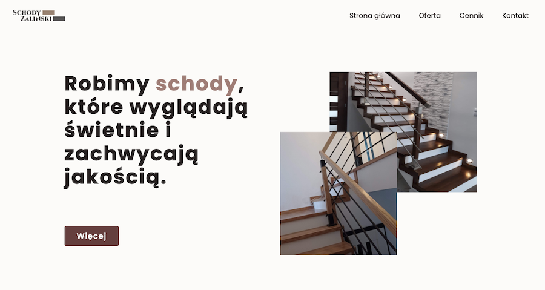
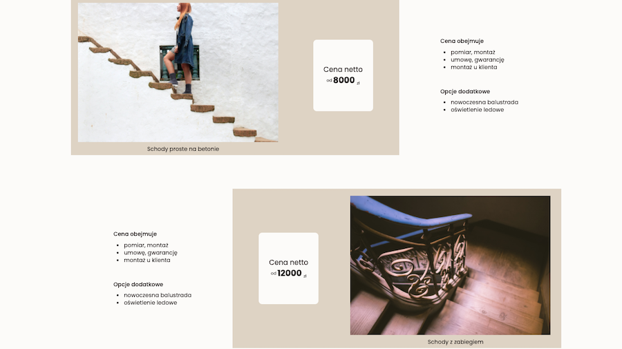
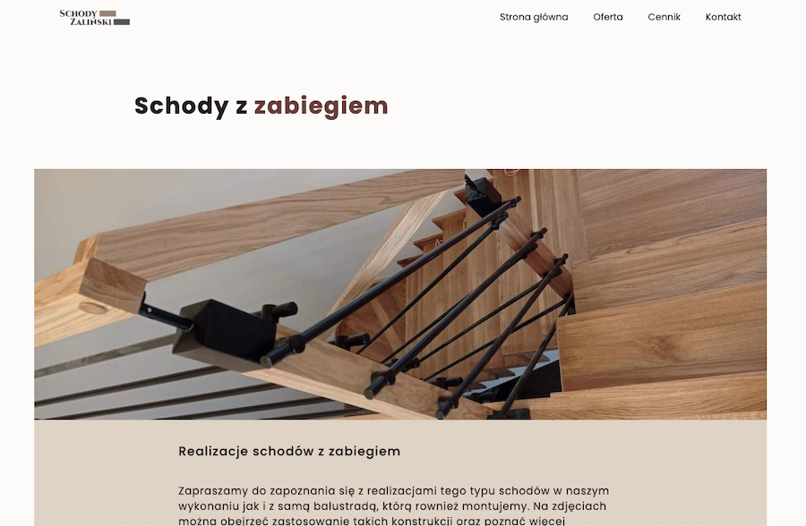
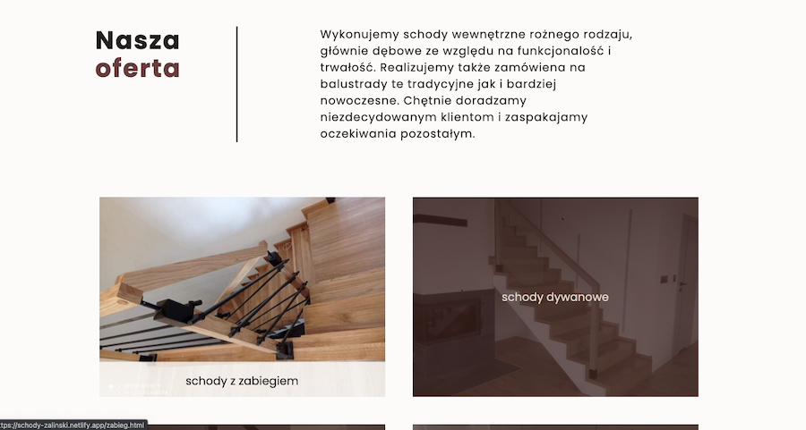
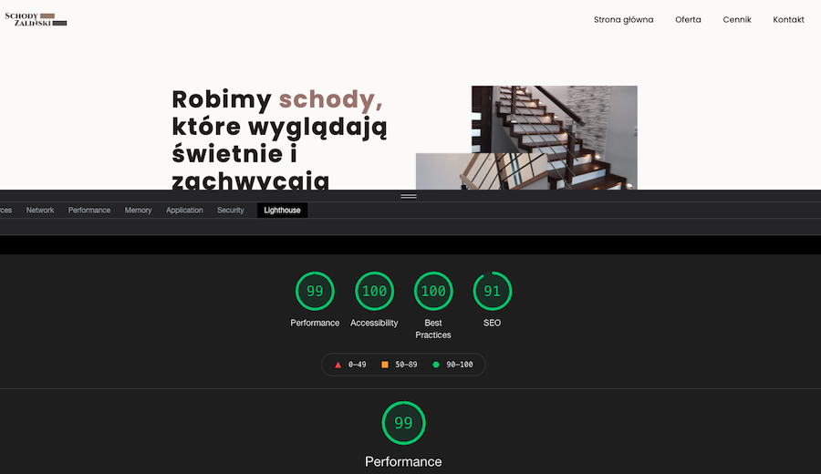
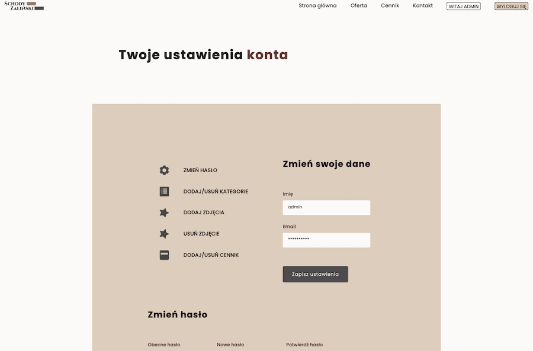

# Schody Zalinski

"A web application which I've made for a client. Simple, fully responsive website with a fast, scalable, and powerful Node.js RESTful APIs. It includes modern authentication with JWT and authorization. Allows for all CRUD operations with MongoDB database."

## Features

- fast time loading page,
- fully responsive,
- browser support,
- image optimizations,
- lazy loading images
- using MVC architecture,
- advanced error handling workflows

## Under the hood

Technologies being used under the hood:

- Node
- Express
- MongoDB
- Mongoose
- RESTful API
- Pug
- Scss

## The only way to check this application is at this link: [https://schodyzalinski.herokuapp.com/login](https://schodyzalinski.herokuapp.com/login)

I will not include config.env file with access for database ( only for special request)

## To Log in please follow instructions:

- login: 'stas@gmail.com'
- password: 'pass1234'
- then click button: 'WITAJ STAS'

### You can also visit Client's Website link

[https://schodyzalinski.pl](https://schodyzalinski.pl)

## Screenshots

### License

MIT

---

Made with [@gregsypek](https://twitter.com/@gregsypek) 2021